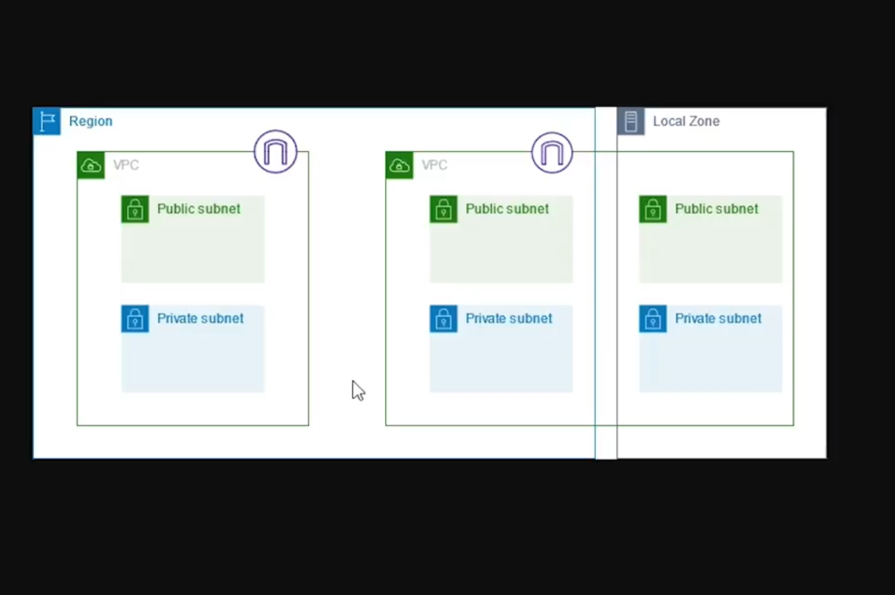
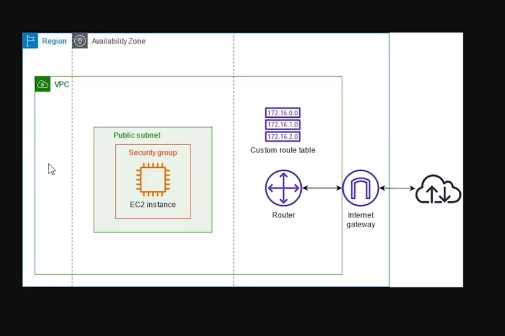
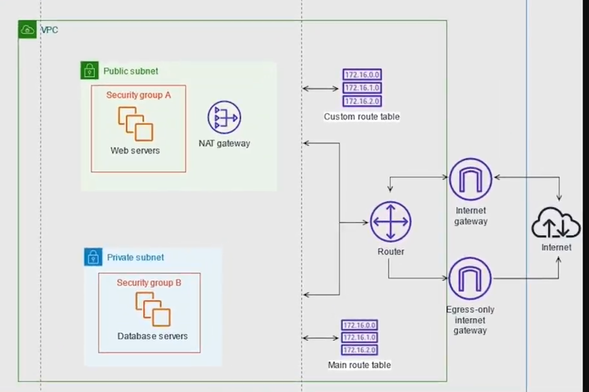

# Networking

## Security Groups as Firewalls

Plugging straight into the internet is a bad idea as you are exposing your computer to unfiltered internet traffic and hackers

At home you use a firewall or home router

AWS uses security groups to solve this

these are firewalls.

You only expose the parts of your server that are configured for public internet traffic

think of these security groups as Line filters on ethernet cords

usually visualised as red and black lines on software architecture diagrams

## Security groups

use Security Groups to change what your ec2 instance can and cannot connect to.

port 80 is http

other standard ports are available

## VPCs

- VPC -  Virtual Private Cloud

Kind of like a LAN

allows ec2 instances to talk to each other.

non routable/ private ips

can be used by any local network

you get a lot of them

## Subnets

a group of sequential ip adresses

a bucket of ip adresses

private subnets are useful for dbs

## NAT Network Address Translation

a door to the internet with a handle on the inside only

can download updates etc

but you can't run a public http/s request

you need to then use port forwarding

then you can run certain types of internet traffic to certain computers

an Internet Gateway in AWS

The security group is the filter the NAT gateway or internet gateway is the door

### WAN 

A WAN (Wide Area Network) port on a router is the designated connection point for your internet service. It's where you plug in the cable (usually from a modem) that provides your internet access.

In AWS you can create a NAT gateway and assign it to a subnet and an elastic ip to make it appear as thoug your gateway has only one ip address

## Elastic IP addresses

gives you a static ip that you can asign to your NAT gateway in AWS

you get penalised for holding onto IPs if ou are not using them

## VPC Architectures

This is a VPC with a single public subnet

This is the what your architecture would look like if you split up your subnets into public and private subnets

nat gateway

If the servers are protected from all outside traffic how do you connect to them

one way

### bastion host template. 

i could not find this at the time, this sets up an EC2 instance inside your subnet that is locked down but exposed to the internet. And you can then access your own EC2 instances inside your VPC

another way

###  AWS Session Manager    

this can be found in systems manager and allows you to set up a connection to your ec2 instance

### use a VPN

use an AWS client vpn to establish a secure connection to your VPC

## Elastic Load Balancer

Scales up and down avalable servers / ec2 instances

point your user at your load balancer

the load balancer directs traffic to different servers epending on what is avalable

allows for scaling up and down the service and allows you to take servers offline and update them etc

- Application Load Balancers (great fr web traffic, routes traffic based on rules)
- Network Load Balancers (High performance, lack features)
- Gateway Load balancers (Switching traffic coming into virtual network appliances)

When setting up a load balancer you need to give it a new security group that has an inbound port of HTTP and all ipv4 traffic and an outbound HTTP rule that is set to your ec2 instances security group

course for load balancing ecs and multi region load balancing

## Using your own domain

AWS route 53 DNS service