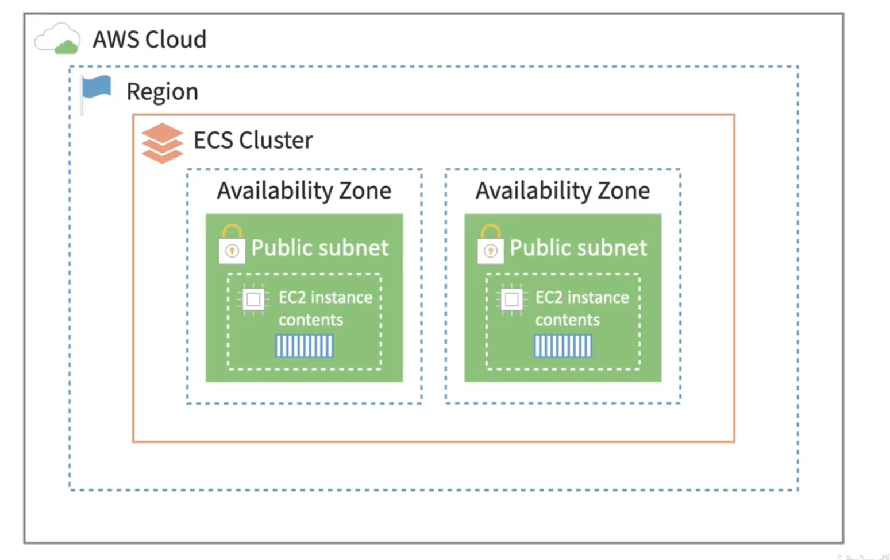
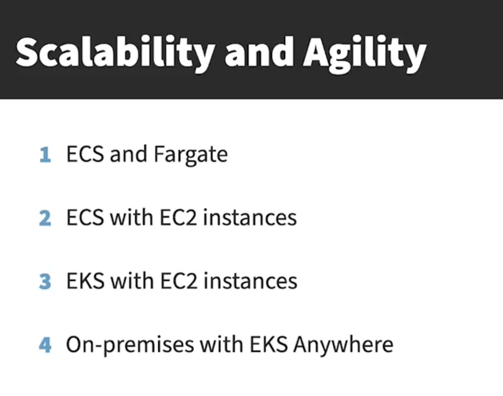

# PaaS Platform as a Service

## Elastic Bean Stalk

Use for hosting wordpress sites etc

- Lightsail can host wordpress sites on AWS

## Containers

Have a container that handles

- sign ups
- payments
- reporting

## ECS Elastic Container Service

Container orchestration tool. Create nodes in the ECS cluster

You can load balance multiple copies of your containers

This allows your app to scale and provides redundnacies if something fails

## ECR Elastic Container Registry

A place in AWS to put container images

### Fargate

Bunch of on demand nodes

willing to run any number of containers

container that only perfoms a single task then stops

pulls an image from s3 and resizes etc

only billed for time it is running

if running all the time just use ec2

### External

Allows you to run containers on your own on prem servers in a hybrid cloud environment

### ECS

create nodes as ec2 instances

Use this for node js

## Kubernetes 
open source version of an internal google product called borg

## EKS Elastic Kubernetes Service

more poular more automation tools

Similar to ECS, kudernetes can be harder to learn but is usable anywhere

more advance networking

Order to do things in

## Lambda

Lambda functions that run a single execution of your code

Serverless architecture

Runs a container on an ec2 instance for you

the servers are not your problem

might help with debugging if you do know something
limited to 15 minute run time

## AWS Batch

manage and schedule jobs that can use ec2 spot instances

you can bid on using amazons unused resource

good for jobs that need to be done sometime before tomoorrow or next week

## Step Functions

 