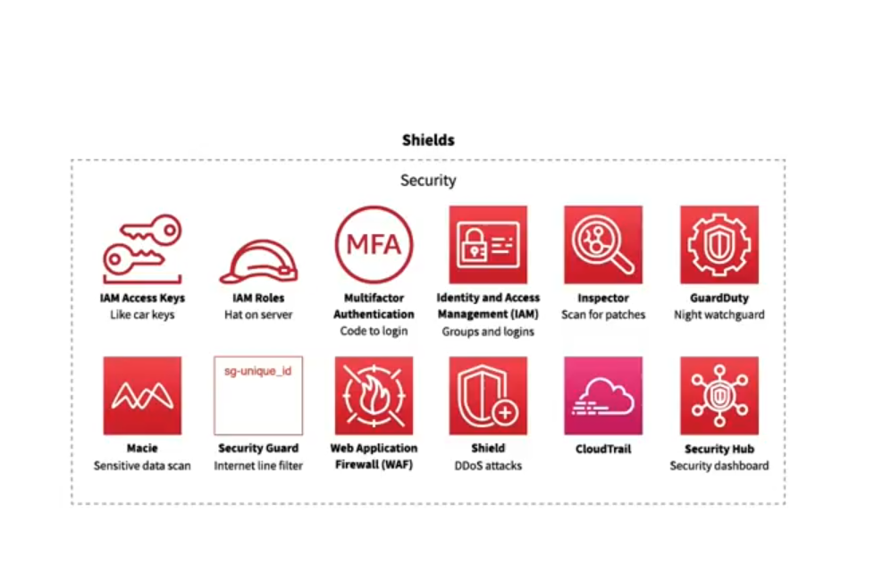

# Security

## Shield

aws.amazon.com/answers/security/aws-secure-account-setup

## WAF web application firewall

can be attached to your load balancer

can offer geo matching

can also apply managed rules

## Shield

helps mitigate ddos

## GuardDuty

night security guard walking around your server

can look in logs

find suspicious connections

## Inspector

scans cloud infrastrucuture 

looks for unpatched servers

or common security vulnerabilities

## Macie

scans cloud resources and looks for sensitive data and reports it to you if it is exposed to the public

s3 wall of shame

## Systems Manager

a suite of tools for managing a suite of ec2 instances

notify you if it is out of compliance, missing hardware

## CloudTrail

audit trail

changes made internally to AWS

log requests through aws api let you know if someone else has your access keys

happens when you aren't looking and you least expect it

## SecurityHub

brings these products under one dashboard

## Amazon Detective